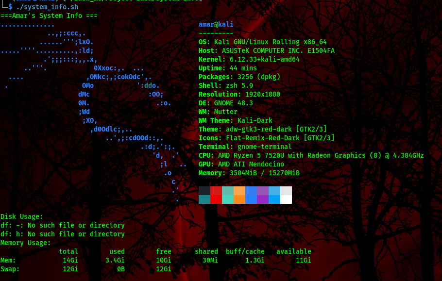
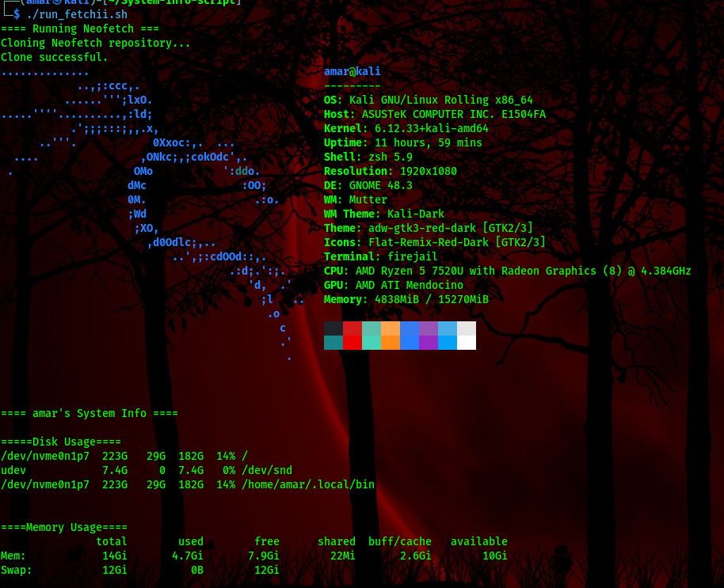

# System Info Script

This repository provides two simple and portable tools for displaying system information on Linux systems:

1. ***run_fetchii.sh**-Runs[Neofetch](auto install it if missing)
2. **system_info.sh**-Lightweight Bash script that prints system details without needing Neofetch

Both are designed to be portable and easy to use.

-------

##  Features
**run_fetchii.sh**
- Automatically clone Neofetch if it's not available.
- Displays system information in a clean, aesthetic format.
- Saves output into 'run_neofetch.log'.
- Shows *system_info.sh* output without running system_info.sh.
**system_info.sh**
- Shows basic system information(OS, Kernal, CPU, RAM, Disk usage, etc...)
- No external dependencies (pure Bash).
- Ideal for minimal environments without Neofetch.

---

## 📦 Requirements
This script uses **Neofetch** to display system information.  
You **don’t need to install Neofetch** system-wide — a portable version is included.

---

##  Usage

1. **Clone this repository**
   ```bash```
   git clone https://github.com/535amar/System-info-script.git
   cd System-info-script

2. **Make this script executable**
   chmod +x run_fetchii.sh

3. **Run it**
  ./run_fetchii.sh


## Screenshots

- Upgraded v1.1.0


## :pushpin: Author
Created by **Amar**
Github: [535amar](https://github.com/535amar)

-----


## Notes
- This script is for **educational purposes** and learning Bash scripting.  
- It shows **your own system’s information** when run.  
- Contributions and suggestions are welcome 
- Feel free to fork and improve this script

## Versioning 
This project uses [Semantic Versioning](https://semver.org)
Release will tagged as 'vMAJOR.MINOR.PATCH(e.g., V1.0.0)

- **V1.1.0** 
